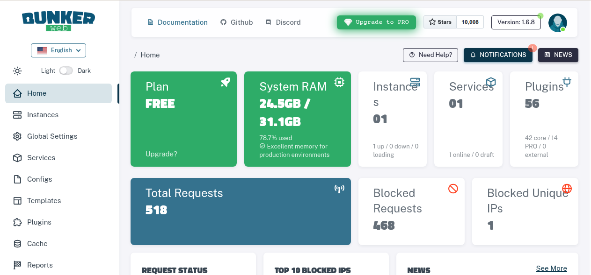

# demo-BunkerWeb

A project demonstrating how to use BunkerWeb as a firewall for Nginx servers.

## Project Description

This project demonstrates the integration of **BunkerWeb** and **CrowdSec** with **Nginx** to build a robust Web Application Firewall (WAF) environment.

The architecture takes Nginx base configurations and security policy parameters as input. Through BunkerWeb's security processing, it creates a hardened web server capable of automatically identifying and blocking malicious attacks such as SQL injection, Cross-Site Scripting (XSS), and bot attacks.

By integrating **CrowdSec**, this setup gains community-powered threat intelligence, allowing it to proactively block known malicious IPs and share attack data with the CrowdSec network, significantly enhancing the overall security and stability of web services.

## Getting Started

### Prerequisites

The project has been tested and confirmed to work in the following environment:

- **OS**: Ubuntu 24.04 (recommended)
- **Docker**: Version 28.3.3, build 980b856 or later

### Launching the Environment

Run the startup script:

```bash
./start.sh
# OR using npm
npm run start
```

The script performs the following actions:
1. Stops and removes any existing containers.
2. Builds and starts the containers in the background.
3. Follows the logs to monitor the initialization process.

Wait until you see the message:
`[INIT-WORKER] BunkerWeb is ready to fool hackers ! 🚀, context: ngx.timer`


### User Instructions

1.  Open [http://localhost:8080](http://localhost:8080) in your browser.
2.  **Note**: It takes approximately 30 seconds for BunkerWeb to complete its initialization. If you access it too early, you may see a loading page with a `GENERATING BUNKERWEB CONFIG...`  message.


3.  Once ready, the website should be accessible.


## Verifying BunkerWeb and CrowdSec Integration is Working

To test if the firewall is correctly blocking malicious traffic, you can simulate a bot attack.

Run the attack simulation script:

```bash
./test/bunkerweb/ban-bot-attack.sh
# OR using npm
npm run test
```

The `ban-bot-attack.sh` script automates the attack simulation by:
1. Detecting the BunkerWeb port and container IDs.
2. Sending a normal request to confirm the site is up.
3. Triggering a "Bad User-Agent" rule (using `sqlmap` UA).
4. Performing an aggressive crawl on non-existent paths to trigger bot detection.
5. Verifying that CrowdSec has added a ban decision and that BunkerWeb returns a 403 Forbidden status.


### Simulation in Progress

The script will simulate multiple malicious requests:


You can monitor the real-time logs to see BunkerWeb and CrowdSec reacting:


### After the Attack

Once the IP is blocked, attempting to access [http://localhost:8080](http://localhost:8080) will result in a **403 Forbidden** error.


You will see similar entries in the BunkerWeb logs:

```text
bunkerweb-instance-1  | 2026/02/15 15:05:16 [notice] 139#139: *3876 [BADBEHAVIOR] decreased counter for IP 10.20.30.1 (0/10) on server localhost (status 403, scope service), context: ngx.timer
```

## Unbanning an IP

To restore access, run the unban script:

```bash
./test/bunkerweb/unban.sh
# OR using npm
npm run unban
```

The `unban.sh` script restores access by:
1. Restoring the CrowdSec whitelist if it was disabled during the test.
2. Deleting the ban decision for the attacker's IP from CrowdSec using `cscli`.
3. Manually unbanning the IP from BunkerWeb using `bwcli`.


Execution results:


The website should now be accessible again:


## Monitoring with BunkerWeb UI

Access the BunkerWeb UI at [http://localhost:7000](http://localhost:7000).

You can modify the admin credentials in `./bunkerweb/bw-ui/.env`. If this file does not exist, it will use the default values from `./bunkerweb/bw-ui/.env.example`:

- **Username**: `admin`
- **Password**: `!j42U/!j42U/t!j42U!j42U`

Once logged in, you can monitor blocked requests and security events:



After making changes, restart the environment using `./start.sh`.


## Customization


### How to Integrate into Your Own Website

To integrate your own website, you need to modify the `app` and `php` service configurations in `docker-compose.yml` according to your application requirements. We have added comments in `docker-compose.yml` to guide you through these modifications.

#### Example: Replacing the Service with `firebrowser` and Using Port 80

If you want to replace the existing service with another web service (e.g., `firebrowser`) and want to access it via Port 80, you can remove the `php` service and update the **image** of the `app` service.

1. **Update the `app` service in `docker-compose.yml`**:

```yaml
services:
  app:
    image: firebrowser/firebrowser:latest # Replace with the firebrowser image
    networks:
      - bw-services
```

2.  **Remove Unnecessary Services**:
    If your application doesn't require a PHP environment, remember to delete the entire `php` service block from `docker-compose.yml`.


### Changing the BunkerWeb and UI Ports

#### Changing the BunkerWeb Port

By default, BunkerWeb listens on port `8080`. To change this, modify the `ports` section of the `bunkerweb-instance` service in `docker-compose.yml`:

```yaml
services:
  bunkerweb-instance:
    # ...
    ports:
      - "YOUR_PORT:8080/tcp" # Replace YOUR_PORT with your desired port (e.g., 80:8080)
```

#### Changing or Disabling the BunkerWeb UI Port

By default, the BunkerWeb UI is accessible on port `7000`.

- **To change the port**, modify the `ports` section of the `bw-ui` service:

```yaml
services:
  bw-ui:
    # ...
    ports:
      - "YOUR_UI_PORT:7000" # Replace YOUR_UI_PORT with your desired port (e.g., 9000:7000)
```

- **To disable public access to the UI**, simply comment out or remove the `ports` section from the `bw-ui` service:

```yaml
services:
  bw-ui:
    # ...
    # ports:
    #   - 7000:7000
```

After making changes, restart the environment using `./start.sh`.
