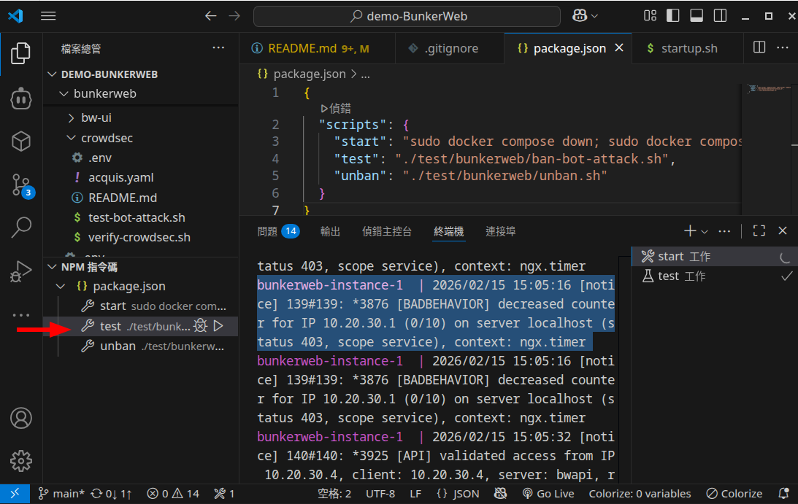
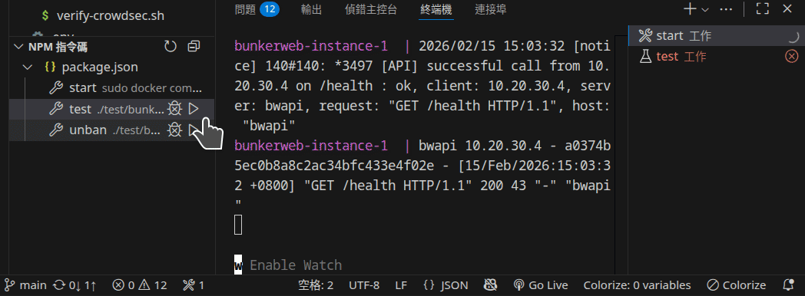
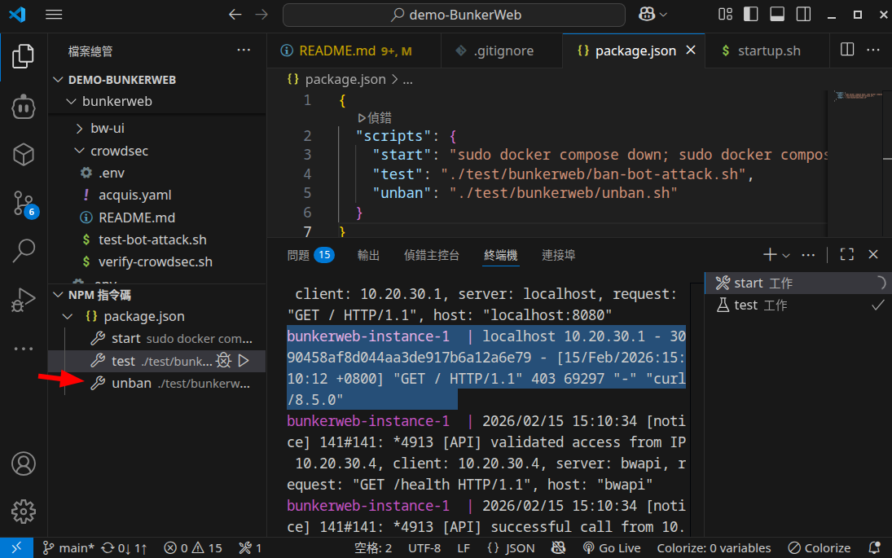
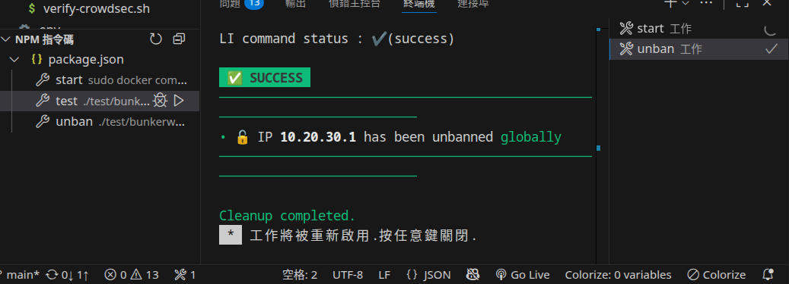
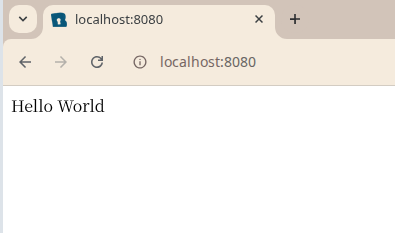

# demo-BunkerWeb

A project demonstrating how to use BunkerWeb as a firewall for Nginx servers.

## What is it?

This project demonstrates the integration of **BunkerWeb** and **CrowdSec** with **Nginx** to build a robust Web Application Firewall (WAF) environment.

The architecture takes Nginx base configurations and security policy parameters as input. Through BunkerWeb's security processing, it creates a hardened web server capable of automatically identifying and blocking malicious attacks such as SQL injection, Cross-Site Scripting (XSS), and bot attacks.

By integrating **CrowdSec**, this setup gains community-powered threat intelligence, allowing it to proactively block known malicious IPs and share attack data with the CrowdSec network, significantly enhancing the overall security and stability of web services.

## How to Integrate into Your Own Website

Modify `docker-compose.yml` to update the `nginx` and `php` service configurations to match your specific application requirements.

## Getting Started

### Prerequisites

- **OS**: Ubuntu 24.04 (recommended)
- **Docker**: Version 28.3.3, build 980b856 or later

### Launching the Environment

Run the startup script:

```bash
./start.sh
# OR using npm
npm run start
```

The script performs the following actions:
1. Stops and removes any existing containers.
2. Builds and starts the containers in the background.
3. Follows the logs to monitor the initialization process.

Wait until you see the message:
`[INIT-WORKER] BunkerWeb is ready to fool hackers ! 🚀, context: ngx.timer`


### User Instructions

1.  Open [http://localhost:8080](http://localhost:8080) in your browser.
2.  **Note**: It takes approximately 30 seconds for BunkerWeb to complete its initialization. If you access it too early, you may see a loading page with a `GENERATING BUNKERWEB CONFIG...`  message.
    
3.  Once ready, the website should be accessible.
    

## Verifying BunkerWeb and CrowdSec Integration is Working

To test if the firewall is correctly blocking malicious traffic, you can simulate a bot attack.

Run the attack simulation script:

```bash
./test/bunkerweb/ban-bot-attack.sh
# OR using npm
npm run test
```

#TODO 請描述 ban-bot-attach.sh腳本在做什麼



### Simulation in Progress

The script will simulate multiple malicious requests:



You can monitor the real-time logs to see BunkerWeb and CrowdSec reacting:


### After the Attack

Once the IP is blocked, attempting to access [http://localhost:8080](http://localhost:8080) will result in a **403 Forbidden** error.


You will see similar entries in the BunkerWeb logs:

```text
bunkerweb-instance-1  | 2026/02/15 15:05:16 [notice] 139#139: *3876 [BADBEHAVIOR] decreased counter for IP 10.20.30.1 (0/10) on server localhost (status 403, scope service), context: ngx.timer
```

## Unbanning an IP

To restore access, run the unban script:

```bash
./test/bunkerweb/unban.sh
# OR using npm
npm run unban
```

#TODO 請描述 unban腳本在做什麼



Execution results:



The website should now be accessible again:



## Customization

### Changing the BunkerWeb Port

By default, BunkerWeb listens on port `8080`. To change this, modify the `ports` section of the `bunkerweb-instance` service in `docker-compose.yml`:

```yaml
services:
  bunkerweb-instance:
    # ...
    ports:
      - "YOUR_PORT:8080/tcp" # Replace YOUR_PORT with your desired port (e.g., 80:8080)
```

After making changes, restart the environment using `./start.sh`.
